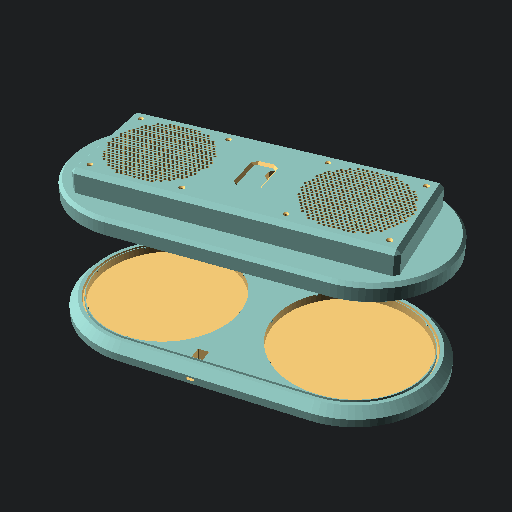

# PC Fan driven open source HEPA filter -- [PCHEPA](https://github.com/jcorbin/pchepa)

OpenSCAD parametric model to integrate commodity PC Fans and cylindrical HEPA
filter cartridges to create personal and readily portable air filters..

## Design

The design is based around integrating readily available PC case fans and cylindrical HEPA filter cartridges.
So the build breaks down mainly involves 6 parts:
- purchased cylindrical HEPA filter cartridge
- purchased PC case fan
- purchased PWM fan control module
- printed base plate under the filter
- printed cover plate between the filter and fan
- printed grill enclosure over/around the fan

Secondarily there can be a flexible mesh wall wrapped around the HEPA filter to
protect it from impact. This wall can be printed in sections, or a suitable
pre-existing product may be used and cut to fit.

Additionally there are various small supporting parts:
- a USB-C 12v Power Delivery trigger module
- electronics wiring kit to integrate the power module, fan control module, and fans
- M3 machine screws to mount fans to cover plates, ideally using heatset inserts
- printed rabbit clips to join base/cover plate pairs
- printed channel plug to fix the USB-C power module in place

Currently the design only supports a 2-filter 2-fan layout inspired by the [Exhalaron][exhalaron],
and uses the same Nyemo H12 / TT-AP006 replacement filters as the exhalaron kit.
However the most readily changed model parameters should be the filter specifics if alternate an alternate filter needs to be sourced.

Any 120mm PC Fan may be used, and the model can easily adapt for larger 140mm PC fans
if needed (likely only makes sense if larger filter are also used).
A good choice would be something like Noctua NF-P12 fans because:
- high static pressure fans like these should be better than airflow optimized fans for this application
- low noise rating should mean that most of the sound created will be by air passing through the filter itself, with little added fan noise
- no unnecessary RGB lighting ; while this point is mostly an aesthetic choice, it also minimizes power waste for a portable battery driven use case

An easy way to control/drive the fans is by using a commodity PWM fan controller, like the Noctua FC1.
This plus a splitter cable and 12v power source suffice to get things spinning.
The design could be adapted to support a DC barrel jack instead of USB-C if desired.
If RGB lighting is desired, a different controller may be desired to get out of default-rainbow mode.

Eventually this project would like to support more involved control boards,
such as an Arduino with additionally added air quality sensor and display.

## Status

- [x] v1 build of a dual-filter/fan model done and works well
- [ ] TODO write step by step build guide based on [v1_build.md](v1_build.md)
- [ ] TODO address v1 build pain points, especially rabbit clip tolerance
- [ ] TODO publish models set somewhere (probably thangs)
- [ ] TODO add code level documentation, especially to customizer parameters
- [ ] TODO evolve parameters, with presets for various fan/filter models
- [ ] TODO complete and build a single filter variant
- [ ] TODO support integrating a battery back or USB power bank
- [ ] TODO support arduino based electronics package, including an [air quality sensor wing][aq_wing]
- [ ] TODO a carrying handle part, or option integrated with the grill top
- [ ] TODO power socket clearance: wallslot depth vs diagonal interior cut, wall thickness between wallslot and channel

[aq_wing]: https://hackaday.io/project/168492-the-air-quality-wing

## Setup

This model is implemented in [OpenSCAD][openscad] using the [BOSL2][bosl2] library.

After cloning this repository, run `git submoule update --init` to ensure the needed copy of BOSL2 is setup.

## Printing

To generate STL models either:
- run `make all` to use default ( to go faster, run something like `make -j4 all` to build models in parallel, e.g. 4 at a time )
- or interactively export models from OpenSCAD by paging through each `mode` value under the `Part Selection` customizer tab

All models are already oriented as intended to print.

General recommended slicer settings:
- layer height: 0.2
- 4 walls
- sparse infill: 15% tri-hexagon
- 4 top/bottom layers
- concentric top surface pattern
- no support material

The flexible mesh wall section should instead be printed with:
- 0 top/bottom layers
- sparse infill: 60% tri-hexagon
- infill direction: 90°

The usb channel plug (U shaped tower in the parts collection) probably needs to be printed with a brim.

### Fit Testing

There are several cut-down fit test models that can be used to verify assembly fitment.
Adjust model tolerance parameters, part metrics, and print slicer settings as needed to get a good fit before printing the full parts.

Power Module Fit Test
: makefile creates `dual/test_fit_power_module.stl`
: a cut-down section of the primary base plate, focusing on just the power module socket, and its fixating channel plug

Wall Fit Test
: makefile creates `dual/test_fit_wall.stl`
: a cut-down section of the base and cover plates, plus 2 reduced-length mesh wall sections
: useful to check plate-filter grip and mesh wall height
: may also be used to check power module fit, since it an instance of the power module socket

Cover Hole Test
: makefile creates `dual/test_fit_cover_hole.stl`
: a cut-down section of the cover plate with 1 fan mounting hole
: primarily useful to verify heatset insert tolerance or direct threading of M3 screws
: may also be used to evaluate side handle affordance and filter-top grip

## License

© 2024 by Joshua T Corbin is licensed under [CC BY-SA 4.0][ccbysa4]

[bosl2]: https://github.com/BelfrySCAD/BOSL2
[exhalaron]: https://www.cleanairkits.com/products/exhalaron
[ccbysa4]: http://creativecommons.org/licenses/by-sa/4.0
[openscad]: https://openscad.org/
