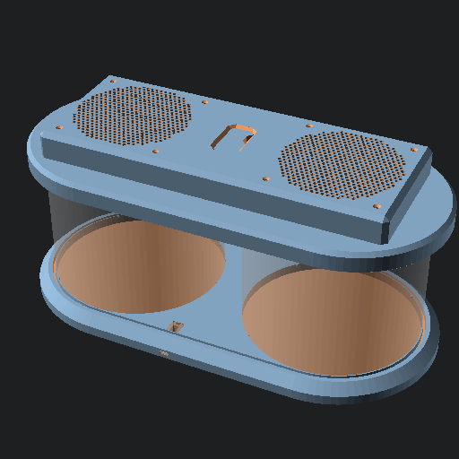

# PC Fan driven open source HEPA filter -- [PCHEPA](https://github.com/jcorbin/pchepa)

OpenSCAD parametric model to integrate commodity PC Fans and cylindrical HEPA
filter cartridges to create personal and readily portable air filters..

## Status

- [x] v1 build of a dual-filter/fan model done and works well
- [ ] TODO write step by step build guide based on [v1_build.md](v1_build.md)
- [ ] TODO address v1 build pain points, especially rabbit clip tolerance
- [ ] TODO publish models set somewhere (probably thangs)
- [ ] TODO add code level documentation, especially to customizer parameters
- [ ] TODO evolve parameters, with presets for various fan/filter models
- [ ] TODO complete and build a single filter variant
- [ ] TODO support integrating a battery back or USB power bank
- [ ] TODO support arduino based electronics package, including an [air quality sensor wing][aq_wing]
- [ ] TODO a carrying handle part, or option integrated with the grill top

[aq_wing]: https://hackaday.io/project/168492-the-air-quality-wing

## Setup

This model is implemented in [OpenSCAD][openscad] using the [BOSL2][bosl2] library.

After cloning this repository, run `git submoule update --init` to ensure the needed copy of BOSL2 is setup.

## Printing

To generate STL models either:
- run `make all` to use default ( to go faster, run something like `make -j4 all` to build models in parallel, e.g. 4 at a time )
- or interactively export models from OpenSCAD by paging through each `mode` value under the `Part Selection` customizer tab

All models are already oriented as intended to print.

General recommended slicer settings:
- layer height: 0.2
- 4 walls
- sparse infill: 15% tri-hexagon
- 4 top/bottom layers
- concentric top surface pattern
- no support material

The flexible mesh wall section should instead be printed with:
- 0 top/bottom layers
- sparse infill: 60% tri-hexagon
- infill direction: 90°

The usb channel plug (U shaped tower in the parts collection) probably needs to be printed with a brim.

### Fit Testing

There are several cut-down fit test models that can be used to verify assembly fitment.
Adjust model tolerance parameters, part metrics, and print slicer settings as needed to get a good fit before printing the full parts.

Power Module Fit Test
: makefile creates `dual/test_fit_power_module.stl`
: a cut-down section of the primary base plate, focusing on just the power module socket, and its fixating channel plug

Wall Fit Test
: makefile creates `dual/test_fit_wall.stl`
: a cut-down section of the base and cover plates, plus 2 reduced-length mesh wall sections
: useful to check plate-filter grip and mesh wall height
: may also be used to check power module fit, since it an instance of the power module socket

Cover Hole Test
: makefile creates `dual/test_fit_cover_hole.stl`
: a cut-down section of the cover plate with 1 fan mounting hole
: primarily useful to verify heatset insert tolerance or direct threading of M3 screws
: may also be used to evaluate side handle affordance and filter-top grip

## License

© 2024 by Joshua T Corbin is licensed under [CC BY-SA 4.0][ccbysa4]

[bosl2]: https://github.com/BelfrySCAD/BOSL2
[ccbysa4]: http://creativecommons.org/licenses/by-sa/4.0
[openscad]: https://openscad.org/
