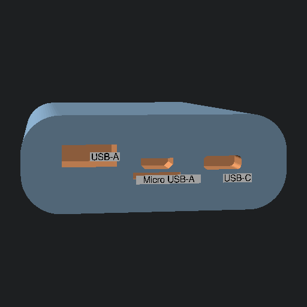

# PCHEPA v1.1 User Guide

For external power, a USB-C adaptor capable of providing 12V is necessary.

Replace the filters as needed with Nyemo H12 / Nyemo TT-AP006 filters; here's an [Amazon link][amaz_nyemo].

In testing the 2 Noctua NF-P12 fans draw around 250mA at 12V.

See toplevel project [README](../README.md) or the [build guide][build_guide] for more.

## Portable Variant

To connect the battery to the power port, a small [USB-C patch cable][amaz_usbc_patch] with a 90-degree works well.

**NOTE**: after being turned off (via the speed knob) and left for some time, the power system will shut itself off fully to prevent vampire draining;
if the unit does not turn on by the knob anymore, simply unplug/replug the USB-C patch cable from the power port.

The internal battery bank will charge fastest over its USB-C port (right side), but can also be charged from its mini USB-A port (middle).
When charging from such a USB-A source, the fans will likely spin much slower than usual, as most USB-A sources provide only 5v.

The battery bank used is [USUIE 12V DC Power Bank][amaz_usuie_12v_bank]; it should have about 10 hours of runtime at full power.

The astute reader will note that 10 hours of runtime at 250mA is merely 2500mAh.
This is only around half of the rated (5500mAh), and a quarter of the marketed (10000mAh).
Such is the seeming reality of current-year commodity electronics / marketing.

The shoulder strap designed for is this one: [shoulder strap][amaz_shoulder_strap] ;
hopefully the anchor holes may also work with other likely messenger bag straps.

[amaz_nyemo]: https://www.amazon.com/gp/product/B08Z32BDJY
[amaz_shoulder_strap]: https://www.amazon.com/dp/B07P3LCZXN
[amaz_usbc_patch]: https://www.amazon.com/dp/B0B6BLQJ8B
[amaz_usuie_12v_bank]: https://www.amazon.com/dp/B0CNGM4V32
[build_guide]: https://github.com/jcorbin/pchepa/blob/main/build_guide.md
